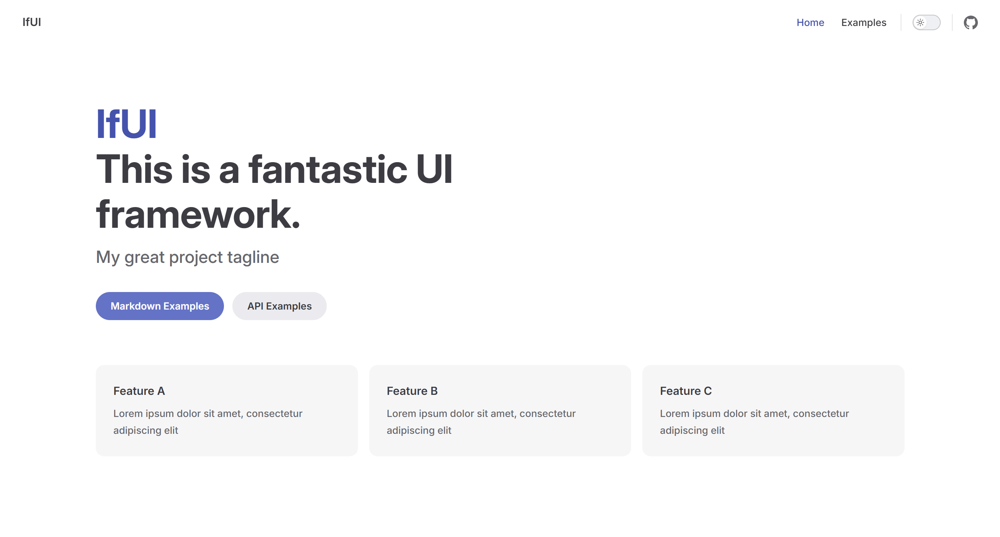
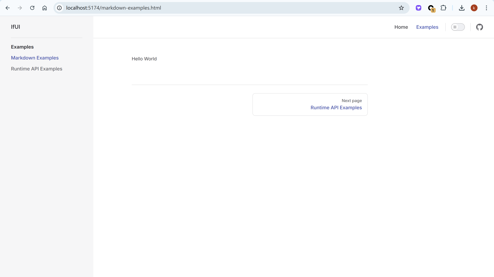
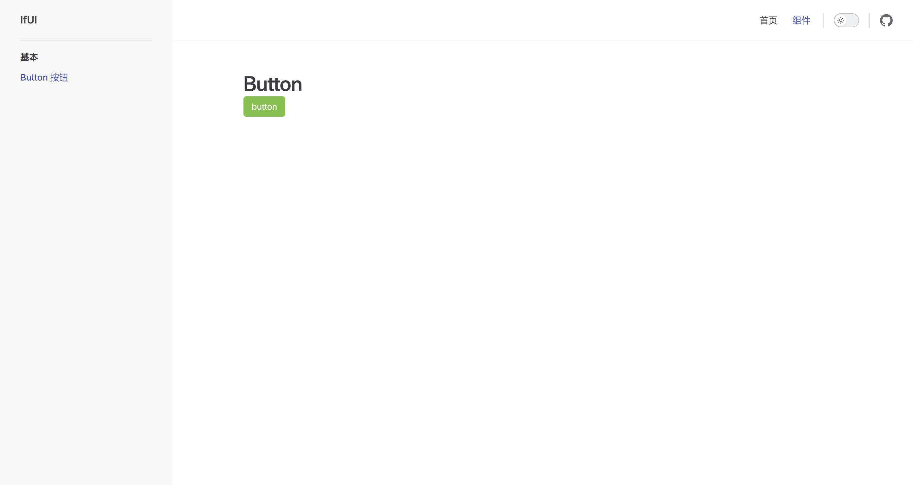
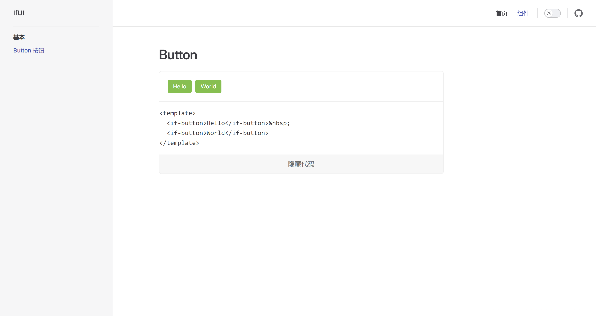

# 进行组件库初始化

1\. 基本目录结构。

```bash
docs # 文档
examples # 实例
  - package.json # name: @ifui/examples
packages # 组件
  - components # 组件
    - package.json # name: @ifui/components
  - theme-chalk # 样式
    - package.json # name: @ifui/components
  - utils # 公共
    - package.json # name: @ifui/components
pnpm-workspace.yaml
```

2\. `pnpm-workspace.yaml`。

```yml
packages:
  - packages/**
  - examples
```

3\. 配置 `.npmrc`。

pnpm 会尝试模仿传统的 npm 和 yarn 行为，将所有依赖项都安装在项目的根 node_modules 文件夹中，解决工具链（如 `jest`、`vite`）和第三方库的路径解析问题，可以确保依赖版本统一，避免冲突。

尽管这一配置会削弱 `pnpm` 的严格隔离优势，但在复杂的 UI 组件库开发中，兼容性和稳定性通常优先于磁盘空间优化。对于开发者来说，这是一个权衡后的实用选择。

```bash
shamefully-hoist = true
```

```bash
pnpm i @ifui/examples -w
pnpm i @ifui/components -w
pnpm i @ifui/theme-chalk -w
pnpm i @ifui/utils -w
```

4\. 4 个 `package.json` 对应的项目间可以互通啦。

5\. 整理组件代码结构。

使用 ElementPlus 的时候如下：

```js
import ElementPlus from "element-plus";
app.use(ElementPlus);
```

意味着 components/index.js

```js
import ElButton from "./button";
export default {
  install(app) {
    app.component("el-button", ElButton);
  },
};
```

```bash
📦button
 ┣ 📂src
 ┃ ┗ 📜button.vue
 ┗ 📜index.js
```

`button/src/button.vue`

```html
<template>
  <button class="if-button">
    <slot />
  </button>
</template>

<script setup>
  defineOptions({
    name: "if-button",
  });
</script>
```

`button/index.js`

```js
import Button from "./src/button.vue";

// 允许用户通过 app.use(Button) 的方式全局注册 Button 组件，例如 examples/index.js
// import IfButton from "@ifui/components/button";
// app.use(IfButton)
Button.install = (app) => {
  app.component(Button.name, Button);
};
export const IfButton = Button;

export default IfButton;
```

统一导入组件，`components/components.js`

```js
export { IfButton } from "./button";
```

`components/index.js`

```js
import * as components from "./components";

export default {
  install(app) {
    Object.entries(components).forEach(([key, value]) => {
      app.component(key, value);
    });
  },
};
```

# 搭建组件预览环境

```bash
📦examples
 ┣ 📜app.vue
 ┣ 📜index.html
 ┣ 📜index.js
 ┣ 📜package.json
 ┗ 📜vite.config.js
```

1\. 根目录，安装 vite 和处理 SFC 的插件。

```bash
# @vitejs/plugin-vue 的主要作用是为 Vite 提供对 Vue 单文件组件的支持
pnpm i @vitejs/plugin-vue vite -D -w
```

`vite.config.js`

```js
import { defineConfig } from "vite";
import vue from "@vitejs/plugin-vue";

export default defineConfig({
  plugins: [vue()],
});
```

`package.json`

```json
{
  "name": "@ifui/examples",
  "type": "module"
  // ...
}
```

2\. 准备模板，通过 createApp 创建应用。

index.html

```html
<!DOCTYPE html>
<html lang="en">
  <head>
    <meta charset="UTF-8" />
    <meta name="viewport" content="width=device-width, initial-scale=1.0" />
    <title>ifui</title>
  </head>

  <body>
    <div id="app"></div>
  </body>
  <script type="module" src="./index.js"></script>
</html>
```

App.vue

```html
<template>
  <div>
    <p>Hello</p>
  </div>
</template>

<script setup></script>

<style scoped></style>
```

examples/index.js

```js
import { createApp } from "vue";
import App from "./App.vue";

const app = createApp(App);
app.mount("#app");
```

`根 package.json`

```json
{
  "scripts": {
    "dev": "vite examples" // 添加启动命令
  }
  // ...
}
```

3\. 使用我们自己的组件。

注册 IfUI 组件

```js
import { createApp } from "vue";
import App from "./app.vue";
import IfUI from "@if-ui/components";

const app = createApp(App);
app.use(IfUI);
app.mount("#app");
```

使用 IfUI 组件中的 button 组件，App.vue

```html
<template>
  <div>
    <p>Hello</p>
    <if-button>World</if-button>
  </div>
</template>

<script setup></script>

<style scoped></style>
```

```bash
pnpm dev
```

# 如何搭建组件文档

1\. 搭建 vitepress 文档。

docs 目录

```bash
npx vitepress init
```

```bash
$ npx vitepress init

┌  Welcome to VitePress!
│
◇  Where should VitePress initialize the config?
│  ./
│
◇  Site title:
│  IfUI
│
◇  Site description:
│  This is a fantastic UI framework.
│
◇  Theme:
│  Default Theme
│
◇  Use TypeScript for config and theme files?
│  No
│
◇  Add VitePress npm scripts to package.json?
│  No
│
└  You're all set! Now run npx vitepress dev and start writing.
```

```bash
📦docs
 ┣ 📂.vitepress
 ┃ ┣ 📂cache
 ┃ ┗ 📜config.mjs
 ┣ 📜api-examples.md
 ┣ 📜index.md
 ┗ 📜markdown-examples.md
```

根目录

```bash
pnpm i vitepress -D -w
```

根 package.json

```json
{
  "docs:dev": "vitepress dev docs",
  "docs:build": "vitepress build docs",
  "docs:preview": "vitepress preview docs"
  // ...
}
```

运行

```bash
pnpm docs:dev
```



要展示我们的组件，需要先安装，通过[自定义主题](https://vitepress.dev/zh/guide/custom-theme)，安装我们的组件库。

docs\.vitepress\theme\index.js

```js
import DefaultTheme from "vitepress/theme";
import IfUI from "@ifui/components";

export default {
  ...DefaultTheme,
  enhanceApp: async ({ app, router, siteData }) => {
    app.use(IfUI);
  },
};
```

清除里面的内容，放我们自己的组件观察效果，docs\markdown-examples.md

```html
<if-button>Hello World</if-button>
```



准备样式，根

```bash
pnpm i less less-loader -D -w
```

packages\theme-chalk\index.less

```less
.if-button {
  padding: 6px 12px;
  border-radius: 4px;
  display: inline-flex;
  justify-content: center;
  align-items: center;
  height: 32px;
  white-space: nowrap;
  color: #fff;
  text-align: center;
  outline: none;
  user-select: none;
  background-color: #67c23a;
  border: 1px solid #dcdfe6;
  border-color: #67c23a;
}
```

在文档注册组件的时候导入样式，`docs\.vitepress\theme\index.js`

```less
import DefaultTheme from "vitepress/theme";
import IfUI from "@ifui/components";
import "@ifui/theme-chalk/index.less";

export default {
  ...DefaultTheme,
  enhanceApp: async ({ app, router, siteData }) => {
    app.use(IfUI);
  },
};

```

确保之前的组件代码，packages\components\button\src\button.vue

```html
<template>
  <button class="if-button">
    <slot />
  </button>
</template>

<script setup>
defineOptions({
  name: "if-button",
});
</script>
```

会发现已经添加上样式拉。


如何预览组件源码？

```bash
📦.vitepress
 ┣ 📂theme
 ┃ ┣ 📂preview
 ┃ ┃ ┗ 📜index.vue
 ┃ ┗ 📜index.ts # 主题配置入口
 ┗ 📜config.mts
```


`docs\.vitepress\theme\code-preview\index.vue`

```html
<template>
  <div><slot /></div>
</template>

<script setup></script>

<style scoped></style>

```

`docs\.vitepress\theme\index.ts`

```js
import DefaultTheme from "vitepress/theme";
import IfUI from "@ifui/components";
import "@ifui/theme-chalk/index.less";
import CodePreview from "./code-preview/index.vue";
export default {
  ...DefaultTheme,
  enhanceApp: async ({ app, router, siteData }) => {
    app.use(IfUI);
    app.component("CodePreview", CodePreview);
  },
};
```

在 markdown-examples.md 中应用一下我们注册的组件，看下是否成功。

```html
<if-button>Hello World</if-button>

<code-preview>🎉</code-preview>
```


docs\components\button\index.md

```md
# Button

<code-preview>
  <if-button>button</if-button>
</code-preview>
```

`docs\.vitepress\config.mts`

```ts
import { defineConfig } from "vitepress";

// https://vitepress.dev/reference/site-config
export default defineConfig({
  title: "IfUI",
  description: "An UI framework.",
  themeConfig: {
    // https://vitepress.dev/reference/default-theme-config
    nav: [
      { text: "首页", link: "/" },
      { text: "组件", link: "/components/button/" },
    ],

    sidebar: [
      {
        text: "基本",
        items: [{ text: "Button 按钮", link: "/components/button/" }],
      },
    ],

    socialLinks: [
      { icon: "github", link: "https://github.com/vuejs/vitepress" },
    ],
  },
});
```



展示代码，`docs\.vitepress\theme\code-preview\index.vue`

```html
<template>
  <div class="preview">
    <div class="preview-content">
      <slot />
    </div>
    <div class="code-wrap">
      <div class="code" :class="{ 'show-code': showCode }">
        <div class="code-inner">
          <pre>{{sourceCode}}</pre>
        </div>
      </div>
      <div class="code-btn" @click="state.showCode = !state.showCode">
        {{ showCode ? "隐藏" : "显示" }}代码
      </div>
    </div>
  </div>
</template>

<script setup>
  import { onMounted, reactive, toRefs } from "vue";

  const props = defineProps({
    compName: {
      type: String,
      default: "",
    },
    demoName: {
      type: String,
      default: "",
    },
  });
  const cmpCode = async () => {
    console.log(props.compName, props.demoName, 888);
    const data = await import(
      `../../../components/${props.compName}/${props.demoName}.vue?raw`
    );
    state.sourceCode = data.default;
  };

  onMounted(cmpCode);

  const state = reactive({
    sourceCode: "",
    showCode: false,
  });

  const { sourceCode, showCode } = toRefs(state);
</script>

<style scoped>
  .preview {
    margin: 20px 0;
    border: 1px solid #efefef;
    border-radius: 6px;
    overflow: hidden;
  }
  .preview-content {
    padding: 20px;
  }
  .code-btn {
    position: relative;
    height: 46px;
    line-height: 46px;
    color: #666;
    text-align: center;
    background: #f7f7f7;
    cursor: pointer;
    z-index: 100;
  }
  .code-btn:hover {
    background: #f2f2f2;
  }
  .code {
    border-top: 1px solid #efefef;
    display: grid;
    grid-template-rows: 0fr;
    transition: grid-template-rows 0.3s ease;
  }
  .code .code-inner {
    overflow: hidden;
  }
  .show-code {
    grid-template-rows: 1fr;
  }
</style>
```

此时会有报错，不用管，继续。

docs\components\button\basic.vue

```html
<template>
  <if-button>Hello</if-button>&nbsp;
  <if-button>World</if-button>
</template>
```

`docs\components\button\index.md`

```html
<script setup>
import basic from './basic.vue'
</script>

# Button

<code-preview comp-name="button" demo-name="basic">
  <basic/>
</code-preview>
```

此时效果如下：



处理代码高亮问题，根目录安装

```bash
pnpm i highlight.js @highlightjs/vue-plugin -w
```

使用 `docs\.vitepress\theme\index.ts`

```ts
import DefaultTheme from "vitepress/theme";
import IfUI from "@ifui/components";
import "@ifui/theme-chalk/index.less";
import CodePreview from "./code-preview/index.vue";
import "highlight.js/styles/base16/summerfruit-light.css";
import hljsVuePlugin from "@highlightjs/vue-plugin";
export default {
  ...DefaultTheme,
  enhanceApp: async ({ app, router, siteData }) => {
    app.use(IfUI);
    app.component("CodePreview", CodePreview);
    app.use(hljsVuePlugin);
  },
};
```

改造 docs\.vitepress\theme\code-preview\index.vue


```html
<template>
  <div class="preview">
    <div class="preview-content">
      <slot />
    </div>
    <div class="code-wrap">
      <div class="code" :class="{ 'show-code': showCode }">
        <div class="code-inner">
          <!-- #2 -->
          <highlightjs autodetect :code="sourceCode" />
        </div>
      </div>
      <div class="code-btn" @click="state.showCode = !state.showCode">
        {{ showCode ? "隐藏" : "显示" }}代码
      </div>
    </div>
  </div>
</template>

<script setup>
import { onMounted, reactive, toRefs } from "vue";
// #1
import "highlight.js";
// ...
</script>
<style scoped>
/* ... */
</style>
```

处理访问 http://localhost:5174/markdown-examples.html 时的报错问题，删除 code-preview 组件，docs\markdown-examples.md

```html
<if-button>Hello World</if-button>
```

# 开发 Button 组件

```bash
📦theme-chalk
 ┣ 📂common
 ┃ ┣ 📜base.less
 ┃ ┗ 📜theme.less
 ┣ 📂components
 ┃ ┣ 📜button.less
 ┃ ┣ 📜icon.less
 ┃ ┗ 📜message.less
 ┣ 📂fonts
 ┃ ┣ 📜iconfont.ttf
 ┃ ┣ 📜iconfont.woff
 ┃ ┗ 📜iconfont.woff2
 ┣ 📜index.less
 ┗ 📜package.json
```

1\. 准备相关样式，packages\theme-chalk\index.less；

```css
// 全局注册的主题变量
@import url(./common/base.less);
// 明暗模式相关的一些颜色变量
@import url(./common/theme.less);
// 各个组件相关的样式
@import url(./components/icon.less);
@import url(./components/button.less);
@import url(./components/message.less);
// ...

```

2\. 准备其他样式；

packages\theme-chalk\common\base.less

```less
:root {
  --if-default: #172b4d;
  --if-primary: #5e72e4;
  --if-success: #2dce89;
  --if-info: #11cdef;
  --if-warning: #fb6340;
  --if-danger: #f5365c;

  --if-border-color: #dcdfe6;
  --if-bg-color: #fff;
  --if-text-color: #3f3f3f;
  --if-placeholder-color: #bfc3d6;
  --if-hover-color: #f2f2f2;
  --if-icon-fill-color: #ccc;
  --if-shadow: rgba(0, 0, 0, 0.12);

  --if-primary-lighten: lighten(#5e72e4, 23%);
  --if-success-lighten: lighten(#2dce89, 45%);
  --if-info-lighten: lighten(#11cdef, 39%);
  --if-warning-lighten: lighten(#fb6340, 35%);
  --if-danger-lighten: lighten(#f5365c, 35%);

  --if-success-border: lighten(#2dce89, 30%);
  --if-info-border: lighten(#11cdef, 30%);
  --if-warning-border: lighten(#fb6340, 30%);
  --if-danger-border: lighten(#f5365c, 30%);
}

@font-face {
  font-family: "if-ui-icons";
  src: url("../fonts/iconfont.woff2") format("woff2"),
    url("../fonts/iconfont.woff") format("woff"),
    url("../fonts/iconfont.ttf") format("truetype");
}

```

packages\theme-chalk\common\theme.less

```less
:root,
[data-color-mode="light"] {
  --background-color: #fff;
  --title: #292d35;
  --icon: #9da2ac;
  --border: #e5e5e5;
  --borderColor: #dee2e6;
  --fontColor: #333;
  --iconColor: #bdc0d3;
  --disabled: #b1b1b1;
}

[data-color-mode="dark"] {
  --background-color: #1a1d24;
  --fontColor: #f2f2f2;
}

```

packages\theme-chalk\components\icon.less

```less
// https://www.iconfont.cn/collections/detail?spm=a313x.collections_index.i1.d9df05512.62613a81H9aMXs&cid=22664
// 引入图标的操作在 base.less 中已经处理

[class^="if-icon-"] {
  display: inline-block;
  font-family: "if-ui-icons" !important;
  font-size: 16px;
  font-style: normal;
  -webkit-font-smoothing: antialiased;
  -moz-osx-font-smoothing: grayscale;
}

.if-icon-3column:before {
  content: "\e663";
}

.if-icon-column-4:before {
  content: "\e664";
}

.if-icon-add:before {
  content: "\e665";
}

.if-icon-add-circle:before {
  content: "\e666";
}

.if-icon-adjust:before {
  content: "\e667";
}

.if-icon-arrow-up-circle:before {
  content: "\e668";
}

.if-icon-arrow-right-circle:before {
  content: "\e669";
}

.if-icon-arrow-down:before {
  content: "\e66a";
}

.if-icon-ashbin:before {
  content: "\e66b";
}

.if-icon-arrow-right:before {
  content: "\e66c";
}

.if-icon-browse:before {
  content: "\e66d";
}

.if-icon-bottom:before {
  content: "\e66e";
}

.if-icon-back:before {
  content: "\e66f";
}

.if-icon-bad:before {
  content: "\e670";
}

.if-icon-arrow-double-left:before {
  content: "\e671";
}

.if-icon-arrow-left-circle:before {
  content: "\e672";
}

.if-icon-arrow-double-right:before {
  content: "\e673";
}

.if-icon-caps-lock:before {
  content: "\e674";
}

.if-icon-camera:before {
  content: "\e675";
}

.if-icon-chart-bar:before {
  content: "\e676";
}

.if-icon-attachment:before {
  content: "\e677";
}

.if-icon-code:before {
  content: "\e678";
}

.if-icon-close:before {
  content: "\e679";
}

.if-icon-check-item:before {
  content: "\e67a";
}

.if-icon-calendar:before {
  content: "\e67b";
}

.if-icon-comment:before {
  content: "\e67c";
}

.if-icon-column-vertical:before {
  content: "\e67d";
}

.if-icon-column-horizontal:before {
  content: "\e67e";
}

.if-icon-complete:before {
  content: "\e67f";
}

.if-icon-chart-pie:before {
  content: "\e680";
}

.if-icon-cry:before {
  content: "\e681";
}

.if-icon-customer-service:before {
  content: "\e682";
}

.if-icon-delete:before {
  content: "\e683";
}

.if-icon-direction-down:before {
  content: "\e684";
}

.if-icon-copy:before {
  content: "\e685";
}

.if-icon-cut:before {
  content: "\e686";
}

.if-icon-data-view:before {
  content: "\e687";
}

.if-icon-direction-down-circle:before {
  content: "\e688";
}

.if-icon-direction-right:before {
  content: "\e689";
}

.if-icon-direction-up:before {
  content: "\e68a";
}

.if-icon-discount:before {
  content: "\e68b";
}

.if-icon-direction-left:before {
  content: "\e68c";
}

.if-icon-download:before {
  content: "\e68d";
}

.if-icon-electronics:before {
  content: "\e68e";
}

.if-icon-drag:before {
  content: "\e68f";
}

.if-icon-elipsis:before {
  content: "\e690";
}

.if-icon-export:before {
  content: "\e691";
}

.if-icon-explain:before {
  content: "\e692";
}

.if-icon-edit:before {
  content: "\e693";
}

.if-icon-eye-close:before {
  content: "\e694";
}

.if-icon-email:before {
  content: "\e695";
}

.if-icon-error:before {
  content: "\e696";
}

.if-icon-favorite:before {
  content: "\e697";
}

.if-icon-file-common:before {
  content: "\e698";
}

.if-icon-file-delete:before {
  content: "\e699";
}

.if-icon-file-add:before {
  content: "\e69a";
}

.if-icon-film:before {
  content: "\e69b";
}

.if-icon-fabulous:before {
  content: "\e69c";
}

.if-icon-file:before {
  content: "\e69d";
}

.if-icon-folder-close:before {
  content: "\e69e";
}

.if-icon-filter:before {
  content: "\e69f";
}

.if-icon-good:before {
  content: "\e6a0";
}

.if-icon-hide:before {
  content: "\e6a1";
}

.if-icon-home:before {
  content: "\e6a2";
}

.if-icon-history:before {
  content: "\e6a3";
}

.if-icon-file-open:before {
  content: "\e6a4";
}

.if-icon-forward:before {
  content: "\e6a5";
}

.if-icon-import:before {
  content: "\e6a6";
}

.if-icon-image-text:before {
  content: "\e6a7";
}

.if-icon-keyboard-26:before {
  content: "\e6a8";
}

.if-icon-keyboard-9:before {
  content: "\e6a9";
}

.if-icon-link:before {
  content: "\e6aa";
}

.if-icon-layout:before {
  content: "\e6ab";
}

.if-icon-fullscreen-shrink:before {
  content: "\e6ac";
}

.if-icon-layers:before {
  content: "\e6ad";
}

.if-icon-lock:before {
  content: "\e6ae";
}

.if-icon-fullscreen-expand:before {
  content: "\e6af";
}

.if-icon-map:before {
  content: "\e6b0";
}

.if-icon-meh:before {
  content: "\e6b1";
}

.if-icon-menu:before {
  content: "\e6b2";
}

.if-icon-loading:before {
  content: "\e6b3";
}

.if-icon-help:before {
  content: "\e6b4";
}

.if-icon-minus-circle:before {
  content: "\e6b5";
}

.if-icon-modular:before {
  content: "\e6b6";
}

.if-icon-notification:before {
  content: "\e6b7";
}

.if-icon-mic:before {
  content: "\e6b8";
}

.if-icon-more:before {
  content: "\e6b9";
}

.if-icon-pad:before {
  content: "\e6ba";
}

.if-icon-operation:before {
  content: "\e6bb";
}

.if-icon-play:before {
  content: "\e6bc";
}

.if-icon-print:before {
  content: "\e6bd";
}

.if-icon-mobile-phone:before {
  content: "\e6be";
}

.if-icon-minus:before {
  content: "\e6bf";
}

.if-icon-navigation:before {
  content: "\e6c0";
}

.if-icon-pdf:before {
  content: "\e6c1";
}

.if-icon-prompt:before {
  content: "\e6c2";
}

.if-icon-move:before {
  content: "\e6c3";
}

.if-icon-refresh:before {
  content: "\e6c4";
}

.if-icon-run-up:before {
  content: "\e6c5";
}

.if-icon-picture:before {
  content: "\e6c6";
}

.if-icon-run-in:before {
  content: "\e6c7";
}

.if-icon-pin:before {
  content: "\e6c8";
}

.if-icon-save:before {
  content: "\e6c9";
}

.if-icon-search:before {
  content: "\e6ca";
}

.if-icon-share:before {
  content: "\e6cb";
}

.if-icon-scanning:before {
  content: "\e6cc";
}

.if-icon-security:before {
  content: "\e6cd";
}

.if-icon-sign-out:before {
  content: "\e6ce";
}

.if-icon-select:before {
  content: "\e6cf";
}

.if-icon-stop:before {
  content: "\e6d0";
}

.if-icon-success:before {
  content: "\e6d1";
}

.if-icon-smile:before {
  content: "\e6d2";
}

.if-icon-switch:before {
  content: "\e6d3";
}

.if-icon-setting:before {
  content: "\e6d4";
}

.if-icon-survey:before {
  content: "\e6d5";
}

.if-icon-task:before {
  content: "\e6d6";
}

.if-icon-skip:before {
  content: "\e6d7";
}

.if-icon-text:before {
  content: "\e6d8";
}

.if-icon-time:before {
  content: "\e6d9";
}

.if-icon-telephone-out:before {
  content: "\e6da";
}

.if-icon-toggle-left:before {
  content: "\e6db";
}

.if-icon-toggle-right:before {
  content: "\e6dc";
}

.if-icon-telephone:before {
  content: "\e6dd";
}

.if-icon-top:before {
  content: "\e6de";
}

.if-icon-unlock:before {
  content: "\e6df";
}

.if-icon-user:before {
  content: "\e6e0";
}

.if-icon-upload:before {
  content: "\e6e1";
}

.if-icon-work:before {
  content: "\e6e2";
}

.if-icon-training:before {
  content: "\e6e3";
}

.if-icon-warning:before {
  content: "\e6e4";
}

.if-icon-zoom-in:before {
  content: "\e6e5";
}

.if-icon-zoom-out:before {
  content: "\e6e6";
}

.if-icon-add-bold:before {
  content: "\e6e7";
}

.if-icon-arrow-left-bold:before {
  content: "\e6e8";
}

.if-icon-arrow-up-bold:before {
  content: "\e6e9";
}

.if-icon-close-bold:before {
  content: "\e6ea";
}

.if-icon-arrow-down-bold:before {
  content: "\e6eb";
}

.if-icon-minus-bold:before {
  content: "\e6ec";
}

.if-icon-arrow-right-bold:before {
  content: "\e6ed";
}

.if-icon-select-bold:before {
  content: "\e6ee";
}

.if-icon-arrow-up-filling:before {
  content: "\e6ef";
}

.if-icon-arrow-down-filling:before {
  content: "\e6f0";
}

.if-icon-arrow-left-filling:before {
  content: "\e6f1";
}

.if-icon-arrow-right-filling:before {
  content: "\e6f2";
}

.if-icon-caps-unlock-filling:before {
  content: "\e6f3";
}

.if-icon-comment-filling:before {
  content: "\e6f4";
}

.if-icon-check-item-filling:before {
  content: "\e6f5";
}

.if-icon-clock-filling:before {
  content: "\e6f6";
}

.if-icon-delete-filling:before {
  content: "\e6f7";
}

.if-icon-decline-filling:before {
  content: "\e6f8";
}

.if-icon-dynamic-filling:before {
  content: "\e6f9";
}

.if-icon-intermediate-filling:before {
  content: "\e6fa";
}

.if-icon-favorite-filling:before {
  content: "\e6fb";
}

.if-icon-layout-filling:before {
  content: "\e6fc";
}

.if-icon-help-filling:before {
  content: "\e6fd";
}

.if-icon-history-filling:before {
  content: "\e6fe";
}

.if-icon-filter-filling:before {
  content: "\e6ff";
}

.if-icon-file-common-filling:before {
  content: "\e700";
}

.if-icon-news-filling:before {
  content: "\e701";
}

.if-icon-edit-filling:before {
  content: "\e702";
}

.if-icon-fullscreen-expand-filling:before {
  content: "\e703";
}

.if-icon-smile-filling:before {
  content: "\e704";
}

.if-icon-rise-filling:before {
  content: "\e705";
}

.if-icon-picture-filling:before {
  content: "\e706";
}

.if-icon-notification-filling:before {
  content: "\e707";
}

.if-icon-user-filling:before {
  content: "\e708";
}

.if-icon-setting-filling:before {
  content: "\e709";
}

.if-icon-switch-filling:before {
  content: "\e70a";
}

.if-icon-work-filling:before {
  content: "\e70b";
}

.if-icon-task-filling:before {
  content: "\e70c";
}

.if-icon-success-filling:before {
  content: "\e70d";
}

.if-icon-warning-filling:before {
  content: "\e70e";
}

.if-icon-folder-filling:before {
  content: "\e70f";
}

.if-icon-map-filling:before {
  content: "\e710";
}

.if-icon-prompt-filling:before {
  content: "\e711";
}

.if-icon-meh-filling:before {
  content: "\e712";
}

.if-icon-cry-filling:before {
  content: "\e713";
}

.if-icon-top-filling:before {
  content: "\e714";
}

.if-icon-home-filling:before {
  content: "\e715";
}

.if-icon-sorting:before {
  content: "\e716";
}

```

packages\theme-chalk\components\button.less

```less
.if-button {
  display: inline-block;
  white-space: nowrap;
  cursor: pointer;
  background-color: #fff;
  border: 1px solid #fff;
  text-align: center;
  box-sizing: border-box;
  outline: none;
  font-weight: 500;
  line-height: 1;
  user-select: none;
  -moz-user-select: none;
  -webkit-user-select: none;
  -ms-user-select: none;
  min-width: 98px;
  padding: 12px 18px;
  font-size: 14px;
  border-radius: 4px;
  box-shadow: 0 4px 6px rgb(50 50 93 / 11%), 0 1px 3px rgb(0 0 0 / 8%);
  &:hover:not(:disabled) {
    box-shadow: 0 7px 14px rgb(50 50 93 / 10%), 0 3px 6px rgb(0 0 0 / 8%);
  }
}
.if-button > .button__inner {
  display: flex;
  align-items: center;
}
.if-button + .if-button {
  margin-left: 12px;
}

.if-button.if-button--small {
  min-width: 92px;
  padding: 10px 18px;
}
.if-button.if-button--mini {
  min-width: 80px;
  padding: 9px 15px;
  font-size: 12px;
  border-radius: 3px;
}
.if-button.if-button--icon {
  min-width: 40px;
  padding: 8px 15px;
  border-radius: 4px;
}
.if-button.is-round {
  box-sizing: border-box;
  border-radius: 20px;
}

.if-button.is-disabled {
  opacity: 0.6;
  cursor: not-allowed;
}
.if-button__default {
  color: var(--if-primary);
  background-color: transparent;
  &:active:not(:disabled) {
    background: #e6e6e6;
    border-color: #e6e6e6;
    color: var(--if-default);
    box-shadow: 0 0 0 transparent;
  }
}

.if-button__primary {
  color: #fff;
  background-color: var(--if-primary);
  border-color: var(--if-primary);
  &:active:not(:disabled) {
    background: #324cdd;
  }
}
.if-button__success {
  color: #fff;
  background-color: var(--if-success);
  border-color: var(--if-success);
  &:active:not(:disabled) {
    background: #24a46d;
  }
}
.if-button__warning {
  color: #fff;
  background-color: var(--if-warning);
  border-color: var(--if-warning);
  &:active:not(:disabled) {
    background: #fa3a0e;
  }
}

.if-button__info {
  color: #fff;
  background-color: var(--if-info);
  border-color: var(--if-info);
  &:active:not(:disabled) {
    background: #0da5c0;
  }
}

.if-button__danger {
  color: #fff;
  background-color: var(--if-danger);
  border-color: var(--if-danger);
  &:active:not(:disabled) {
    background: #ec0c38;
  }
}

.is-plain {
  box-shadow: 0 0 0 transparent;
  &:hover {
    box-shadow: 0 0 0 transparent;
  }
}

.if-button__default.is-plain {
  &:hover,
  &:focus {
    background: transparent;
    border-color: var(--if-default);
    color: var(--if-default);
  }
}
.if-button__primary.is-plain {
  color: var(--if-primary);
  background: transparent;
  border-color: var(--if-primary);
  &:hover:not(:disabled),
  &:active:not(:disabled) {
    color: #fff;
    background: var(--if-primary);
    border-color: var(--if-primary);
  }
  &:hover:not(:disabled) {
    box-shadow: 0 7px 14px rgb(50 50 93 / 10%), 0 3px 6px rgb(0 0 0 / 8%);
  }
  &:active:not(:disabled) {
    box-shadow: 0 0 0 transparent;
  }
}
.if-button__success.is-plain {
  color: var(--if-success);
  background: transparent;
  border-color: var(--if-success);
  &:hover:not(:disabled),
  &:active:not(:disabled) {
    color: #fff;
    background: var(--if-success);
    border-color: var(--if-success);
  }
  &:hover:not(:disabled) {
    box-shadow: 0 7px 14px rgb(50 50 93 / 10%), 0 3px 6px rgb(0 0 0 / 8%);
  }
  &:active:not(:disabled) {
    box-shadow: 0 0 0 transparent;
  }
}
.if-button__warning.is-plain {
  color: var(--if-warning);
  background: transparent;
  border-color: var(--if-warning);
  &:hover:not(:disabled),
  &:active:not(:disabled) {
    color: #fff;
    background: var(--if-warning);
    border-color: var(--if-warning);
  }
  &:hover:not(:disabled) {
    box-shadow: 0 7px 14px rgb(50 50 93 / 10%), 0 3px 6px rgb(0 0 0 / 8%);
  }
  &:active:not(:disabled) {
    box-shadow: 0 0 0 transparent;
  }
}
.if-button__info.is-plain {
  color: var(--if-info);
  background: transparent;
  border-color: var(--if-info);
  &:hover:not(:disabled),
  &:active:not(:disabled) {
    color: #fff;
    background: var(--if-info);
    border-color: var(--if-info);
  }
  &:hover:not(:disabled) {
    box-shadow: 0 7px 14px rgb(50 50 93 / 10%), 0 3px 6px rgb(0 0 0 / 8%);
  }
  &:active:not(:disabled) {
    box-shadow: 0 0 0 transparent;
  }
}
.if-button__danger.is-plain {
  color: var(--if-danger);
  background: transparent;
  border-color: var(--if-danger);
  &:hover:not(:disabled),
  &:active:not(:disabled) {
    color: #fff;
    background: var(--if-danger);
    border-color: var(--if-danger);
  }
  &:hover:not(:disabled) {
    box-shadow: 0 7px 14px rgb(50 50 93 / 10%), 0 3px 6px rgb(0 0 0 / 8%);
  }
  &:active:not(:disabled) {
    box-shadow: 0 0 0 transparent;
  }
}

@keyframes rotating {
  0% {
    transform: rotate(0);
  }

  to {
    transform: rotate(360deg);
  }
}

.if-button .icon-loading {
  animation: rotating 2s linear infinite;
}

```

packages\theme-chalk\components\message.less

```less
.if-message-container {
  position: fixed;
  left: 50%;
  transform: translateX(-50%);
  z-index: 1000;
  transition: all 0.35s;
}

.slideY-fade-enter-active,
.slideY-fade-leave-active {
  transition: all 10s ease;
}
.slideY-fade-enter-from,
.slideY-fade-leave-to {
  opacity: 0;
  transform: translate(-50%, -100%);
}

@keyframes fadeIn {
  0% {
    transform: translateY(-30px);
    opacity: 0;
  }
  100% {
    transform: translateY(0);
    opacity: 1;
  }
}

.if-message {
  padding: 0 30px 0 12px;
  min-width: 260px;
  min-height: 44px;
  line-height: 44px;
  border-radius: 6px;
  animation: fadeIn 0.3s;
  .if-message__text {
    margin-left: 10px;
    font-size: 14px;
  }
  .if-message_close_icon {
    position: absolute;
    right: 10px;
    font-size: 12px;
    cursor: pointer;
  }
  &.if-message__success {
    background-color: var(--if-success-lighten);
    border: 1px solid var(--if-success-border);
    color: var(--if-success);
  }
  &.if-message__info {
    background-color: var(--if-info-lighten);
    border: 1px solid var(--if-info-border);
    color: var(--if-info);
  }
  &.if-message__warning {
    background-color: var(--if-warning-lighten);
    border: 1px solid var(--if-warning-border);
    color: var(--if-warning);
  }
  &.if-message__error {
    background-color: var(--if-danger-lighten);
    border: 1px solid var(--if-danger-border);
    color: var(--if-danger);
  }
}

```


3\. 并在 examples\index.js 中引入 index.less；

```html
import { createApp } from "vue";
import App from "./App.vue";
import IfUI from '@ifui/components'
import "@ifui/theme-chalk/index.less";
const app = createApp(App);
app.use(IfUI)
app.mount("#app");
```


4\. 存放 props、emit、枚举等，packages\components\button\src\button.js

```js
const BUTTON_TYPE = [
  "default",
  "primary",
  "success",
  "warning",
  "info",
  "danger",
];
const BUTTON_SIZE = ["", "small", "mini"];

export const ButtonProps = {
  // 类型
  type: {
    type: String,
    default: "default",
    validator(value) {
      return BUTTON_TYPE.includes(value);
    },
  },
  // 尺寸
  size: {
    type: String,
    default: "",
    validator(value) {
      return BUTTON_SIZE.includes(value);
    },
  },
  plain: {
    type: Boolean,
    default: false,
  },
  // 圆角
  round: {
    type: Boolean,
    default: false,
  },
  // 图标
  icon: {
    type: String,
    default: "",
  },
  // 是否禁用
  disabled: {
    type: Boolean,
    default: false,
  },
  // 加载
  loading: {
    type: Boolean,
    default: false,
  },
};
```

5\. packages\components\button\src\button.vue

```html
<template>
  <button
    class="if-button"
    :class="[
      `${size && 'if-button--' + size}`,
      `if-button__${type}`,
      { 'if-button--icon': icon },
      { 'is-plain': plain },
      { 'is-disabled': disabled || loading },
      { 'is-round': round },
    ]"
    :disabled="disabled || loading"
  >
    <div class="if-button__inner">
      <i v-if="loading" class="if-icon icon-loading"></i>
      <i v-if="icon" :class="['if-icon', `icon-${icon}`]"></i>
      <span v-if="$slots.default">
        <slot />
      </span>
    </div>
  </button>
</template>

<script setup>
import { ButtonProps } from "./button";

defineOptions({
  name: "if-button",
});

defineProps(ButtonProps);
</script>

```

